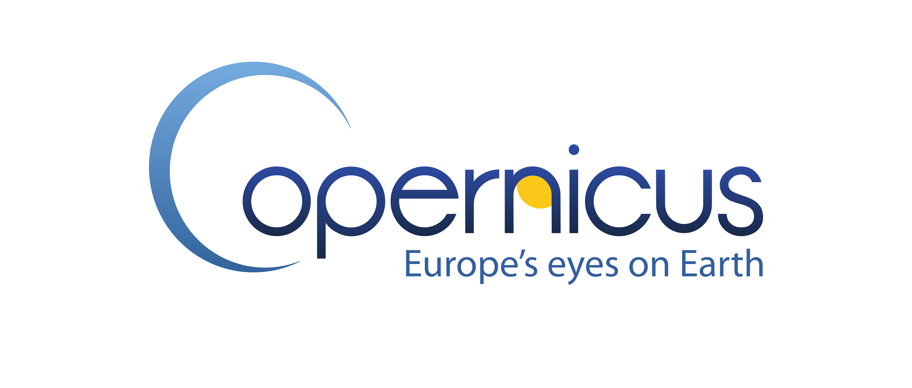

.. _conda: https://docs.conda.io/en/latest/

.. _Github repository: https://github.com/glamod/marine_qc

.. _git: https://git-scm.com/book/en/v2/Getting-Started-Installing-Git

.. _IPython: https://jupyter.readthedocs.io/en/latest/install.html

.. _issue tracker: https://github.com/glamod/marine_qc/issues

.. _jupyter notebook: https://jupyter.org/install

.. _pip: https://pypi.org/

.. _python3: https://www.python.org/download/releases/3.0

.. _tarball: https://github.com/glamod/mdf_reader/tarball/master

.. |logo_c3s| image:: _static/images/logo_c3s-392x154.png
        :width: 25%
        :target: https://climate.copernicus.eu/

.. |logo_ICOADS| image:: _static/images/icoadsLogo.png
        :width: 20%
        :target: https://icoads.noaa.gov/

